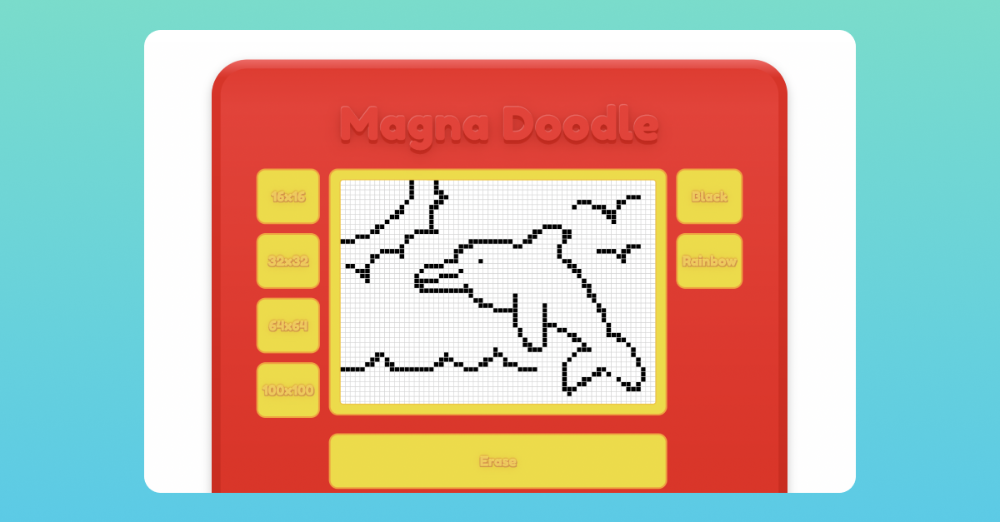

# TOP JavaScript Basics Foundations Project - Etch-A-Sketch

[Draw on Magna Doodle](https://emhng.github.io/odin-etchasketch/)

## Drawing locally

If you'd like to draw locally:

1. Download this repo by clicking on Code -> Download zip
2. Unzip the downloaded repo and open the folder
3. Click on index.html

## Project Objectives

Using HTML, CSS, and Javascript build a browser version of something between a sketchpad and an Etch-A-Sketch.

Must include:

- The sketchpad grid cells should be made using Javascript
- Be able to change the resolution of the sketchpad grid (from 16x16 up to 100x100)
- A way to clear the sketchpad

## Learnings

Used a lot of principles that I had used in the Rock Paper Scissors project, such as using objects as data holders.

Spent a lot of time resolving bugs that involved the drawing function -
luckily a lot of the bugs were easily resolved by just changing what was being targeted or the order of the code.

Continuing to find that checking how the site looks and functions in different browsers and screen sizes is important.
